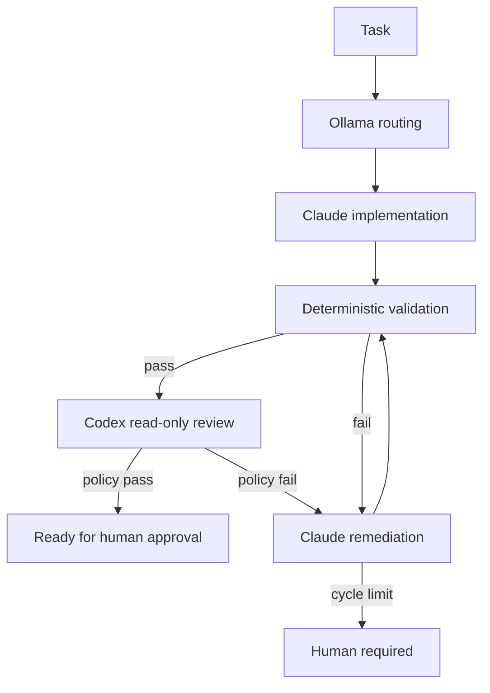

# IAEngine

This .NET 10 CLI is an isolated baseline of a local, deterministic AI engineering
orchestrator. It coordinates agents; agents never invoke one another. Git is the
shared repository state and a human remains the final approval/merge authority.

The current implementation preserves an OnlineOS compatibility profile while the
generic runtime composition boundary is still a follow-up. It must not be read as
an already-complete adapter for arbitrary consumer projects.

## Architecture

Provider-specific behavior sits behind small interfaces (`ITaskRouter`, `IImplementationAgent`, `IReviewAgent`, `IProcessRunner`, `IValidationRunner`, `IGitService`, and `IRunStore`). `Pipeline/Orchestrator.cs` alone owns transitions and loop limits.



The explicit workflow states are `Created`, `Routing`, `Routed`, `Implementing`, `Validating`, `Reviewing`, `Remediating`, `Approved`, `HumanRequired`, and `Failed`. Git has its own persisted lifecycle (`BranchReady` through `Published`); `Approved` means ready for Git finalization and human review, never silently merged.

## Installation

Requirements on macOS:

- .NET 10 SDK
- Git
- [Ollama](https://ollama.com/) with a model selected by the operator
- Claude Code CLI, authenticated for local headless use
- Codex CLI, authenticated for non-interactive use
- Flutter only after Flutter validation commands are enabled

Claude is the autonomous implementation agent for normal development inside the
resolved OnlineOS repository. The orchestrator launches it with that repository as
`WorkingDirectory` and the default tools `Read Edit Write Glob Grep Bash`. Bash enables
routine local Flutter/Dart/.NET/Node dependency, build, generation, formatting, test,
analysis, and read-only Git commands without per-command human approval. This is not
unrestricted machine access: Claude is instructed not to traverse parents, inspect
sibling projects, access production/secrets, deploy, push, merge, rebase, reset, clean,
delete branches, or perform destructive database operations.

Build and test:

```bash
cd .
dotnet build
dotnet test tests/OnlineOs.AiOrchestrator.Tests.csproj
```

## Local Ollama Router

The configured development machine is an Apple Silicon MacBook Pro with an 8-core Apple M1, 16 GB unified memory, Metal 3 acceleration, and ample local disk space. These generic specifications are recorded only to explain the model choice; no machine identifier is stored here.

The selected router is `qwen3:4b`, a roughly 2.5 GB Ollama artifact. It is small enough to coexist with an IDE, Flutter tooling, browser, and simulator while providing materially better instruction and project-term handling than sub-2B models. It is used only for classification, routing, context selection, and JSON generation—not implementation or final review. Qwen3 open-weight models are published under the permissive [Apache 2.0 license](https://github.com/QwenLM/Qwen3), suitable for commercial development subject to the license terms.

The smaller fallback recommendation is `qwen3:1.7b` (roughly 1.4 GB). It is not downloaded automatically and should be used only if the 4B model's memory or latency becomes disruptive.

The orchestrator calls only the loopback API at `http://localhost:11434`. It does not configure Ollama Cloud, paid APIs, authentication secrets, or a public listener. Install or verify Ollama using its official macOS distribution, then explicitly pull the selected model:

```bash
ollama --version
ollama serve
ollama list
ollama pull qwen3:4b
curl http://127.0.0.1:11434/api/version
```

The checked-in inference settings are deliberately conservative:

- context size: 4096 tokens; routing receives task text and a small domain/skills/context index, never the repository contents
- temperature: `0.0`
- seed: `42`
- thinking: disabled, avoiding unnecessary hidden-reasoning latency for classification
- timeout: 60 seconds
- malformed-response retries: one
- output: JSON-only contract with validated task type, risk, complexity, and pipeline enums

The C# adapter filters skills and context paths against its known repository index. Deterministic policy elevates offline-plus-sync and authentication/security work to high risk and sends implementation-bearing tasks to `claude-codex`, even if the local model underrates them. If Ollama is unavailable, missing, slow, or repeatedly malformed, the safe fallback is `complexity=medium`, `risk=medium` (or a validated explicit task risk), and `recommendedPipeline=claude-codex`.

Example structured route:

```json
{
  "type": "feature",
  "domains": ["service-order", "offline", "sync"],
  "complexity": "medium",
  "risk": "high",
  "skills": ["ai/skills/flutter-feature/SKILL.md"],
  "relevantContext": ["docs/OFFLINE_SYNC.md", "architecture/ARCHITECTURE.md"],
  "recommendedPipeline": "claude-codex",
  "reasoningSummary": "Offline synchronization requires implementation and independent review."
}
```

Verify integration with:

```bash
dotnet run -- preflight
dotnet run -- task "Allow a technician to check in while offline and synchronize later" --dry-run
ollama ps
```

Milestone Git lifecycle is deterministic and agent-independent:

```bash
dotnet run -- milestone start M2
dotnet run -- status
dotnet run -- milestone finalize M2 --approved
```

The coordinator fetches and evaluates ancestry, fast-forwards only when safe, creates the explicit branch from `developer`, commits only configured workspace paths, pushes normally, validates after merge, and stops at `HUMAN_REQUIRED` for dirty trees, divergence, conflicts, protected branches, or an external branch switch. It never resets, cleans, stashes, rebases, force-pushes, deletes branches, or touches the reference monolith.

To switch models, pull one model explicitly and change `Ollama.Model` in `appsettings.json`, or set `ONLINEOS_OLLAMA_MODEL` for a local override. Re-run preflight and all three representative routing checks before accepting it. Do not enlarge the 4096-token routing context merely because a model supports a much larger window.

## Autonomous milestones

The version-controlled roadmap is `ai/roadmap/MILESTONES.json`; mutable execution
state is stored atomically in `.ai-state/roadmap-state.json`. Milestones execute one
ready task at a time in roadmap order. A task is marked `Done` only after its normal
run reaches `Approved`/`PASS`, and all tasks must finish before the milestone enters
`CompleteAwaitingApproval`.

```bash
dotnet run -- milestone M2
dotnet run -- status
dotnet run -- continue
dotnet run -- milestone approve M2
```

Checkpoint approval never starts the next milestone. It only permits a later manual
`milestone M3` command. A task-level `HumanRequired` or `Failed` state pauses/stops
the milestone and is distinct from successful milestone checkpoint approval.

Troubleshooting:

- Connection refused: start the local Ollama application/service and verify `curl http://127.0.0.1:11434/api/version`.
- Model missing: run `ollama list`, pull the exact configured tag, and retry preflight.
- Slow routing: inspect `ollama ps`, close memory-heavy development tools, or evaluate the documented 1.7B fallback rather than increasing timeouts immediately.
- Invalid JSON or invented paths: inspect the routing artifact; the adapter retries once and then applies deterministic fallback.
- Excess memory: Ollama unloads idle models automatically; `ollama stop qwen3:4b` unloads it immediately without deleting the downloaded model.

## Configuration

`appsettings.json` is the checked-in safe default. `appsettings.example.json` shows future Flutter checks, which remain disabled while `app/` has no Flutter project.

Supported environment overrides:

- `ONLINEOS_ORCHESTRATOR_CONFIG`: absolute or relative path to another JSON config
- `ONLINEOS_OLLAMA_BASE_URL`
- `ONLINEOS_OLLAMA_MODEL`
- `ONLINEOS_CLAUDE_COMMAND`
- `ONLINEOS_CODEX_COMMAND`

No secrets belong in either configuration file. The CLI tools own their authentication. Arguments are arrays and processes are started without a shell. The workspace boundary uses canonical, path-aware checks for orchestrator-managed paths and rejects traversal, absolute-outside, sibling, symlink, and prefix-confusion paths. It is not a kernel/OS sandbox for arbitrary Bash: a general shell can technically address paths outside its working directory. Stronger filesystem isolation requires a future macOS sandbox profile or container that also permits the installed development toolchains.

## Preflight

```bash
dotnet run -- preflight
```

This checks Git, repository discovery, Ollama, the configured model, Claude, Codex, and Flutter when required. A real task will not start while a critical prerequisite is missing.

## Dry run

```bash
dotnet run -- task "Implement offline check-in" --dry-run
```

Dry-run routing may use Ollama or the deterministic fallback. It reports the safe route summary and persists the task-aware engineering profile, intended validation commands, and Codex review mode without persisting a full provider prompt. It does not start Claude, Codex, validation commands, or modify application files.

## Running a task

Real execution is intentionally operator-controlled and must happen on a feature/work branch:

```bash
dotnet run -- task "Implement task ONLINEOS-142"
dotnet run -- task-file ./task.json
```

Example task file:

```json
{
  "id": "ONLINEOS-142",
  "title": "Implement offline check-in",
  "description": "Implement the documented technician check-in behavior.",
  "type": "feature",
  "domains": ["service-order", "offline", "sync"],
  "risk": "high",
  "skills": ["ai/skills/flutter-feature/SKILL.md"],
  "relevantContext": ["docs/OFFLINE_SYNC.md"],
  "acceptanceCriteria": ["Criteria must be traced to confirmed REQ-* entries."]
}
```

The implementation prompt is sent through standard input. Claude's default implementation tools are `Read`, `Edit`, `Write`, `Glob`, `Grep`, and `Bash`, so it can autonomously run normal repository development commands (Flutter/Dart/.NET/Node builds, analyzers, formatters, tests, code generation, and read-only Git inspection). This is development autonomy, not unrestricted machine access: the prompt prohibits sibling projects, parent-directory traversal, production access, secrets, deployment, and destructive or remote Git lifecycle operations. Claude runs with the resolved OnlineOS repository as its working directory; deterministic path handling protects orchestrator-managed paths, but Bash is a general-purpose shell and this application-level boundary is not an OS filesystem sandbox. A future OS/container sandbox is required for stronger sibling-project isolation. Claude output and Codex output must contain valid JSON. Process command, exit code, stdout, stderr, timeout status, and duration are captured.

## Review and remediation policy

Code determines the gate. A `CRITICAL` finding blocks. A `HIGH` finding blocks when marked `blocking`. `MEDIUM` and `LOW` are recorded but normally do not block. An explicit Codex `FAIL` blocks. The policy and maximum remediation count are configurable.

Each routed task receives a deterministic applicability profile based on the canonical
[`architecture/ENGINEERING_STANDARDS.md`](../../architecture/ENGINEERING_STANDARDS.md).
Claude receives that profile for implementation, and Codex must return all applicable
quality categories as structured `PASS`, `FAIL`, or `NOT_APPLICABLE` assessments.
Missing required validation commands are recorded explicitly; only configured command
results establish deterministic build, analysis, formatting, or test success.

Claude may run routine development commands during implementation, but the configured
`ValidationRunner` independently reruns authoritative checks after Claude exits. Codex
remains the independent reviewer and human approval remains the final checkpoint.

Validation failure or review failure becomes external feedback for Claude. Claude is instructed to evaluate it, not obey it blindly. After two remediation cycles by default, the run stops at `HumanRequired`.

## Logs

Each invocation creates `.ai-runs/RUN-*/` with `run.json`, `task.json`, routing, validation, review, remediation, or dry-run artifacts as applicable. State transitions are saved as they occur. Usage fields allow provider/model/tokens/cost, but unavailable values stay null and are never fabricated. Common secret-shaped JSON fields are redacted as a defense in depth; agents must still avoid returning secrets.

## Safety boundaries

- No merge, push, force-push, branch deletion, deployment, production access, or destructive Git operations exist.
- `main` and `master` are blocked for real implementation by default.
- Codex runs with its configured read-only sandbox argument.
- Commands execute directly, without a shell.
- Timeouts stop process trees.
- Dry run never invokes implementation or review agents.
- Human approval remains outside this CLI.

## Branch workflow

This is the required operator workflow, not a behavior the CLI enforces beyond the
`main`/`master` guard described in Safety boundaries above — the orchestrator does not
currently know about `producao` or `developer` specifically, so running it there is a
human mistake the tool will not stop.

Run the orchestrator only on a feature or `ai/`-prefixed work branch; do not run it
directly on `developer` or `producao`. Those work branches merge into `developer` once
a run reaches `Approved` and a human accepts the PR. `developer` is promoted to
`producao` only after separate validation on `developer` itself — the orchestrator
does not perform or gate that promotion; it is a human decision outside this CLI.

## Troubleshooting

- `Model FAIL`: configure `Ollama.Model` or `ONLINEOS_OLLAMA_MODEL`, then verify `ollama list`.
- `Ollama FAIL`: start the local Ollama service and check `Ollama.BaseUrl`.
- `Claude FAIL` or `Codex FAIL`: install/authenticate that CLI or set its command override.
- Protected branch failure: switch to a feature/work branch. Do not set `AllowProtectedBranch` merely to bypass the guard.
- Malformed agent output: inspect the corresponding `.ai-runs` artifact and CLI output; the run will fail safely.

## Deliberately deferred

GitHub Issues ingestion, worktree creation, PR creation, GitHub Actions, QA/E2E agents, RAG/vector search, metrics dashboards, merge, and deployment are extension points, not V1 behavior. Future providers should implement existing interfaces rather than alter the pipeline state machine.
